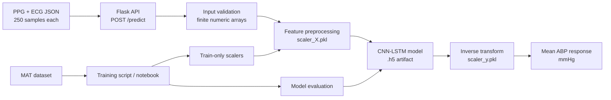

# ABP Estimation API

[](https://www.python.org/)
[](https://flask.palletsprojects.com/)
[](https://www.tensorflow.org/)

A production-style Flask service that exposes a CNN-LSTM model for estimating **mean arterial blood pressure (ABP)** from fixed-length photoplethysmography (PPG) and electrocardiography (ECG) signal windows.

This repository demonstrates a complete applied ML workflow: a notebook for source-data exploration and training, a modular training script, explicit preprocessing validation, artifact-backed inference, a tested API boundary, Docker packaging, and GitHub Actions quality checks.

> **Important:** This is an educational and portfolio project. It is not a certified medical device and must not be used for diagnosis, treatment, or clinical decision-making.

## Architecture



## Technical Stack

| Area | Technologies |
| --- | --- |
| API | Python, Flask, JSON REST endpoint |
| ML | TensorFlow/Keras, CNN-LSTM, NumPy |
| Signal preprocessing | StandardScaler, fixed 250-sample PPG/ECG windows |
| Training and evaluation | SciPy MAT loader, scikit-learn, RMSE, R² |
| Packaging | Docker, environment-based configuration |
| Quality | pytest, Ruff, local quality checks |

## Repository Structure

```text
.
├── app.py                         # Backward-compatible application launcher
├── src/abp_service/
│   ├── app.py                     # Flask application factory and routes
│   ├── config.py                  # Environment-backed runtime settings
│   ├── model_service.py            # Artifact loading and prediction orchestration
│   └── preprocessing.py            # Validation and feature preparation
├── models/                         # Trained model and fitted scalers
├── notebooks/training_pipeline.ipynb
├── scripts/
│   ├── train.py                   # Reproducible training and export entry point
│   ├── infer_request.py            # Deterministic API client
│   └── smoke_test.py               # Health plus prediction smoke test
├── tests/                          # Fast unit and API tests with fake model bundle
├── Dockerfile
├── render.yaml                    # Render Free Blueprint
├── .dockerignore
├── .env.example
├── requirements.txt
└── requirements-dev.txt
```

## Quick Start

### Local setup

Python 3.11 is recommended. The repository includes the trained artifacts under `models/`.

```bash
git clone https://github.com/Fatoomnoour/ABP.git
cd ABP
python -m venv .venv
source .venv/bin/activate
python -m pip install --upgrade pip
python -m pip install -r requirements.txt
cp .env.example .env
python app.py
```

The API starts on `http://localhost:5000`. **ngrok is disabled by default**; local development does not need a public tunnel. The first start loads the checked-in Keras model and scalers, so startup can take longer than a lightweight Flask application.

### Docker

```bash
docker build -t abp-estimation-api .
docker run --rm -p 5000:5000 -e PORT=5000 abp-estimation-api
```

The image runs Gunicorn with one worker and two threads. The container defaults to port `5000`; platforms such as Render can override `PORT` at runtime. Verify the container from another terminal:

```bash
curl -fsS http://localhost:5000/
```

To use a tunnel for a temporary demo, pass the token only at runtime. Never commit it to source control:

```bash
docker run --rm -p 5000:5000 \
  -e ENABLE_NGROK=true \
  -e NGROK_AUTHTOKEN="$NGROK_AUTHTOKEN" \
  abp-estimation-api
```

### Run tests and linting

The test suite injects a fake model bundle, so it does not load the large TensorFlow artifact.

```bash
python -m pip install -r requirements-dev.txt
python -m pytest -q
python -m ruff check .
```

## API Contract

### `GET /`

Returns service status, model availability, and the expected signal format.

### `POST /predict`

Request body:

```json
{
  "ppg": [0.1, 0.2, "... 250 numeric values total ..."],
  "ecg": [0.1, 0.2, "... 250 numeric values total ..."]
}
```

Successful response:

```json
{
  "predicted_mean_abp": 120.5,
  "unit": "mmHg"
}
```

Invalid JSON, missing fields, incorrect lengths, non-numeric values, and non-finite values return HTTP `400`. If the model is unavailable, the API returns HTTP `503`; unexpected inference failures return HTTP `500` without leaking internal exception details to the client.

Use the deterministic request helper after starting the server:

```bash
python scripts/infer_request.py
# or
python scripts/smoke_test.py
```

## Training and Reproducibility

The original exploratory notebook is preserved at `notebooks/training_pipeline.ipynb`. It loads the MAT-format `BloodPressureDataset`, segments signals into 250-sample windows, uses PPG and ECG as two input channels, and predicts the mean ABP of each window.

The modular equivalent is:

```bash
python scripts/train.py \
  --data-file /path/to/part_1.mat \
  --output-dir models \
  --epochs 25 \
  --batch-size 64
```

The script exports `CNN_LSTM_Model_256.h5`, `scaler_X.pkl`, and `scaler_y.pkl` to the selected output directory. Unlike the original notebook, the refactored script fits the scalers on the training split only to avoid preprocessing leakage into evaluation.

The notebook records a test RMSE of **5.03 mmHg** for its original run. This figure is dataset-, split-, and environment-specific and is included as historical notebook evidence; it has not been presented as a clinical validation result or independently reproduced by the lightweight CI job.

## Security and Operations

The API reads runtime configuration from environment variables. The supported variables are documented in `.env.example`, while `.env` is ignored by Git. `NGROK_AUTHTOKEN` is optional and is only read when `ENABLE_NGROK=true`.

If a credential has ever been committed, deleting it from the current file is not sufficient because Git history may still contain it. Revoke or rotate the credential in the provider dashboard first, then rewrite affected history and force-push only after reviewing the impact on collaborators.

## Limitations and Next Improvements

This project currently serves a single fixed-length input contract and a single model artifact. It does not yet include authentication, rate limiting, request tracing, model versioning, automated data drift monitoring, a clinical validation protocol, or a production cloud deployment. The checked-in model and scalers are portfolio artifacts; retraining requires access to the original MAT dataset, which is not included in this repository.

Natural next steps are to add a versioned model registry, container image publishing, structured metrics, contract tests against a deployed staging service, and a documented clinical-safety review before any non-demo use.

## Deploy on Render Free

Render Free is suitable for a portfolio or demonstration deployment, not for a production medical service. Free web services may spin down after inactivity and are subject to monthly usage limits. The repository includes `render.yaml`, so the service can be configured as a Docker web service with the root `Dockerfile`, the `main` branch, the `/` health check, and the `free` plan.

To deploy, create or sign in to a Render account, select **New → Blueprint**, connect the GitHub repository `Fatoomnoour/ABP`, and choose the `render.yaml` file. Confirm that the service runtime is **Docker** and that the instance type is **Free**. Render will build the root Dockerfile and use the Dockerfile command to start Gunicorn. The service must receive its runtime `PORT` from Render; do not hard-code the public port in the start command.

If the Blueprint flow is unavailable, create a **Web Service** manually from the repository and use the following values:

| Setting | Value |
| --- | --- |
| Runtime | Docker |
| Branch | `main` |
| Dockerfile path | `./Dockerfile` |
| Docker context | repository root |
| Plan | Free |
| Health check path | `/` |
| `ENABLE_NGROK` | `false` |

After deployment, open the generated `onrender.com` URL and verify the service status:

```bash
curl -fsS https://YOUR-SERVICE.onrender.com/
```

A healthy response includes `"status": "ok"` and a boolean `"model_loaded"`. To test prediction, send exactly 250 numeric values for both signals. This example creates a valid request without manually typing 500 numbers:

```bash
python - <<'PY' | curl -fsS -X POST "https://YOUR-SERVICE.onrender.com/predict" \
  -H "Content-Type: application/json" --data-binary @-
import json
print(json.dumps({"ppg": [0.1] * 250, "ecg": [0.2] * 250}))
PY
```

When a Render deployment fails, inspect the **Build Logs** first for dependency or Docker errors, then inspect **Runtime Logs** for model-loading and port-binding errors. The most common checks are that the Dockerfile is in the repository root, the service is configured as a Docker web service, `PORT` is not hard-coded in the platform settings, and all three model artifacts exist under `models/`.

## Environment Variables

| Variable | Default | Purpose |
| --- | --- | --- |
| `MODEL_PATH` | `models/CNN_LSTM_Model_256.h5` | Keras model artifact path |
| `SCALER_X_PATH` | `models/scaler_X.pkl` | Input scaler path |
| `SCALER_Y_PATH` | `models/scaler_y.pkl` | Output scaler path |
| `SAMPLE_SIZE` | `250` | Required samples per PPG/ECG signal |
| `HOST` | `0.0.0.0` | Bind address |
| `PORT` | `5000` locally | HTTP port; supplied by Render in deployment |
| `ENABLE_NGROK` | `false` | Optional tunnel switch; keep disabled on Render |
| `NGROK_AUTHTOKEN` | unset | Required only when ngrok is explicitly enabled |

## Troubleshooting

If local startup reports a missing TensorFlow library, recreate the virtual environment with Python 3.11 and reinstall `requirements.txt`. If a request returns `400`, verify that the body is JSON, contains both `ppg` and `ecg`, and contains exactly 250 finite numeric samples in each list. A `503` response means the model bundle was not available, while a `500` response means inference failed; the API intentionally returns a generic error instead of exposing internal exception details.

If the Render service sleeps, the first request after inactivity can be slow while the free instance starts. This is expected behavior of the free plan and is not an application crash. For a continuously available or clinical deployment, use a paid, monitored service and complete an appropriate security and clinical validation review.

## References

1. [Render: Deploy for Free](https://render.com/docs/free)
2. [Render: Docker Deployments](https://render.com/docs/docker)
3. [Render: Blueprint YAML Reference](https://render.com/docs/blueprint-spec)
4. [Streamlit Community Cloud](https://streamlit.io/cloud)
5. [Streamlit app dependencies](https://docs.streamlit.io/deploy/streamlit-community-cloud/deploy-your-app/app-dependencies)

## PythonAnywhere Free: Known Limitation

PythonAnywhere can create a Python 3.11 WSGI app without a paid plan, and the repository includes `pythonanywhere_wsgi.py` for that setup. However, this ABP repository is **not deployable on the current PythonAnywhere Free storage quota** with its full TensorFlow dependency stack: installing `tensorflow-cpu==2.15.1` failed with `OSError: [Errno 122] Disk quota exceeded` even after clearing pip cache and retrying with `--no-cache-dir`. Use the Streamlit Community Cloud path above for the free interactive demo, or use Render/Docker when card verification and a larger runtime are available.

## Current Hosting Status

The previous Railway deployment entries are historical failed deployments from the expired trial period. Render supports the repository's Docker setup, but its current account flow requested card verification before creating a Blueprint. No card details were entered and no paid action was performed. The code and `render.yaml` are ready for Render if verification is acceptable. For a no-card demo, deploy `streamlit_app.py` through Streamlit Community Cloud; PythonAnywhere is documented above only to record its storage limitation for this dependency set.

For platform-specific instructions, see [PythonAnywhere Flask deployment](https://help.pythonanywhere.com/pages/FlaskWithTheNewWebsiteSystem/), [Render free services](https://render.com/docs/free), and [Render Docker deployments](https://render.com/docs/docker).

## Deploy a Free Interactive Demo on Streamlit Community Cloud

The current repository also includes `streamlit_app.py`, a small interactive frontend that uses the same `ABPInferenceEngine` and checked-in model artifacts. This is the recommended no-card path after PythonAnywhere Free rejected the TensorFlow installation because its 512 MB storage quota was exceeded. Streamlit Community Cloud deploys public GitHub repositories for free and installs Python dependencies from `requirements.txt`.

1. Sign in to [Streamlit Community Cloud](https://streamlit.io/cloud) with GitHub and authorize access to `Fatoomnoour/ABP`.
2. Create an app from the `main` branch and set the main file path to `streamlit_app.py`.
3. Keep the Python runtime at 3.11, wait for dependency installation, and open the generated `streamlit.app` URL.
4. Paste two JSON arrays containing exactly 250 finite numeric values each, then click **Predict ABP**.

The original Flask REST API remains available for Docker/Render deployments through `app.py`; Streamlit is a separate public demo entry point and does not replace the `/predict` API contract. The Streamlit demo caches the model per process, validates malformed JSON and signal length before loading the model, and provides a downloadable JSON prediction. Because this is an educational medical-signal demo, do not use its output for diagnosis or treatment.

PythonAnywhere Free cannot currently host the full `tensorflow-cpu==2.15.1` dependency set in this account: the installation reached the 207.2 MB wheel and failed with `OSError: [Errno 122] Disk quota exceeded`. Render remains a Docker-ready option, but its account flow requested card verification before service creation. Neither a paid service nor card details were used.
