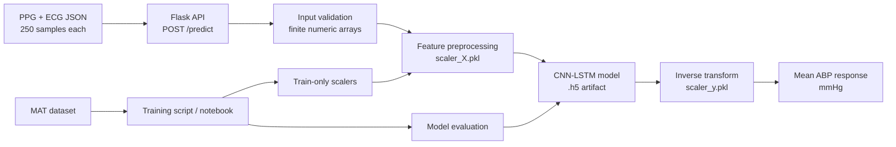

# ABP Estimation API

[](https://www.python.org/)
[](https://flask.palletsprojects.com/)
[](https://www.tensorflow.org/)

A production-style Flask service that exposes a CNN-LSTM model for estimating **mean arterial blood pressure (ABP)** from fixed-length photoplethysmography (PPG) and electrocardiography (ECG) signal windows.

This repository demonstrates a complete applied ML workflow: a notebook for source-data exploration and training, a modular training script, explicit preprocessing validation, artifact-backed inference, a tested API boundary, Docker packaging, and GitHub Actions quality checks.

> **Important:** This is an educational and portfolio project. It is not a certified medical device and must not be used for diagnosis, treatment, or clinical decision-making.

## Architecture



## Technical Stack

| Area | Technologies |
| --- | --- |
| API | Python, Flask, JSON REST endpoint |
| ML | TensorFlow/Keras, CNN-LSTM, NumPy |
| Signal preprocessing | StandardScaler, fixed 250-sample PPG/ECG windows |
| Training and evaluation | SciPy MAT loader, scikit-learn, RMSE, R² |
| Packaging | Docker, environment-based configuration |
| Quality | pytest, Ruff, local quality checks |

## Repository Structure

```text
.
├── app.py                         # Backward-compatible application launcher
├── src/abp_service/
│   ├── app.py                     # Flask application factory and routes
│   ├── config.py                  # Environment-backed runtime settings
│   ├── model_service.py            # Artifact loading and prediction orchestration
│   └── preprocessing.py            # Validation and feature preparation
├── models/                         # Trained model and fitted scalers
├── notebooks/training_pipeline.ipynb
├── scripts/
│   ├── train.py                   # Reproducible training and export entry point
│   ├── infer_request.py            # Deterministic API client
│   └── smoke_test.py               # Health plus prediction smoke test
├── tests/                          # Fast unit and API tests with fake model bundle
├── Dockerfile
├── .env.example
├── requirements.txt
└── requirements-dev.txt
```

## Quick Start

### Local setup

Python 3.11 is recommended. The repository includes the trained artifacts under `models/`.

```bash
git clone https://github.com/Fatoomnoour/ABP.git
cd ABP
python -m venv .venv
source .venv/bin/activate
pip install --upgrade pip
pip install -r requirements.txt
cp .env.example .env
python app.py
```

The API starts on `http://localhost:5000`. **ngrok is disabled by default**; local development does not need a public tunnel.

### Docker

```bash
docker build -t abp-estimation-api .
docker run --rm -p 5000:5000 abp-estimation-api
```

To use a tunnel for a temporary demo, pass the token only at runtime. Never commit it to source control:

```bash
docker run --rm -p 5000:5000 \
  -e ENABLE_NGROK=true \
  -e NGROK_AUTHTOKEN="$NGROK_AUTHTOKEN" \
  abp-estimation-api
```

### Run tests and linting

The test suite injects a fake model bundle, so it does not load the large TensorFlow artifact.

```bash
pip install -r requirements-dev.txt
pytest -q
ruff check .
```

## API Contract

### `GET /`

Returns service status, model availability, and the expected signal format.

### `POST /predict`

Request body:

```json
{
  "ppg": [0.1, 0.2, "... 250 numeric values total ..."],
  "ecg": [0.1, 0.2, "... 250 numeric values total ..."]
}
```

Successful response:

```json
{
  "predicted_mean_abp": 120.5,
  "unit": "mmHg"
}
```

Invalid JSON, missing fields, incorrect lengths, non-numeric values, and non-finite values return HTTP `400`. If the model is unavailable, the API returns HTTP `503`; unexpected inference failures return HTTP `500` without leaking internal exception details to the client.

Use the deterministic request helper after starting the server:

```bash
python scripts/infer_request.py
# or
python scripts/smoke_test.py
```

## Training and Reproducibility

The original exploratory notebook is preserved at `notebooks/training_pipeline.ipynb`. It loads the MAT-format `BloodPressureDataset`, segments signals into 250-sample windows, uses PPG and ECG as two input channels, and predicts the mean ABP of each window.

The modular equivalent is:

```bash
python scripts/train.py \
  --data-file /path/to/part_1.mat \
  --output-dir models \
  --epochs 25 \
  --batch-size 64
```

The script exports `CNN_LSTM_Model_256.h5`, `scaler_X.pkl`, and `scaler_y.pkl` to the selected output directory. Unlike the original notebook, the refactored script fits the scalers on the training split only to avoid preprocessing leakage into evaluation.

The notebook records a test RMSE of **5.03 mmHg** for its original run. This figure is dataset-, split-, and environment-specific and is included as historical notebook evidence; it has not been presented as a clinical validation result or independently reproduced by the lightweight CI job.

## Security and Operations

The API reads runtime configuration from environment variables. The supported variables are documented in `.env.example`, while `.env` is ignored by Git. `NGROK_AUTHTOKEN` is optional and is only read when `ENABLE_NGROK=true`.

If a credential has ever been committed, deleting it from the current file is not sufficient because Git history may still contain it. Revoke or rotate the credential in the provider dashboard first, then rewrite affected history and force-push only after reviewing the impact on collaborators.

## Limitations and Next Improvements

This project currently serves a single fixed-length input contract and a single model artifact. It does not yet include authentication, rate limiting, request tracing, model versioning, automated data drift monitoring, a clinical validation protocol, or a production cloud deployment. The checked-in model and scalers are portfolio artifacts; retraining requires access to the original MAT dataset, which is not included in this repository.

Natural next steps are to add a versioned model registry, container image publishing, structured metrics, contract tests against a deployed staging service, and a documented clinical-safety review before any non-demo use.
